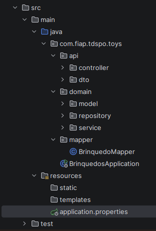
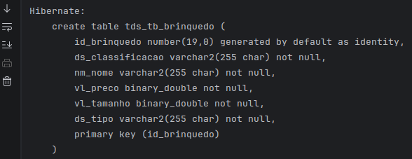
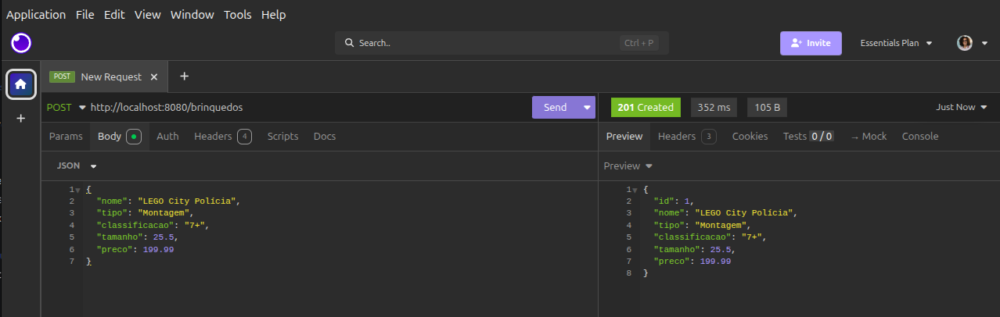
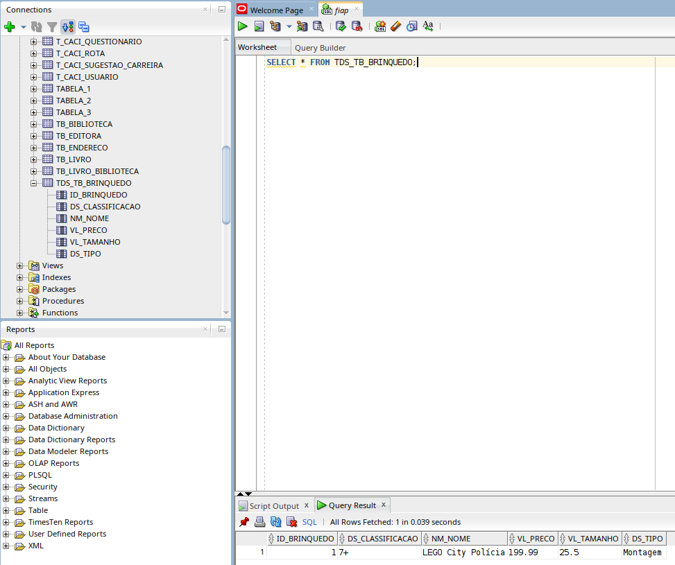
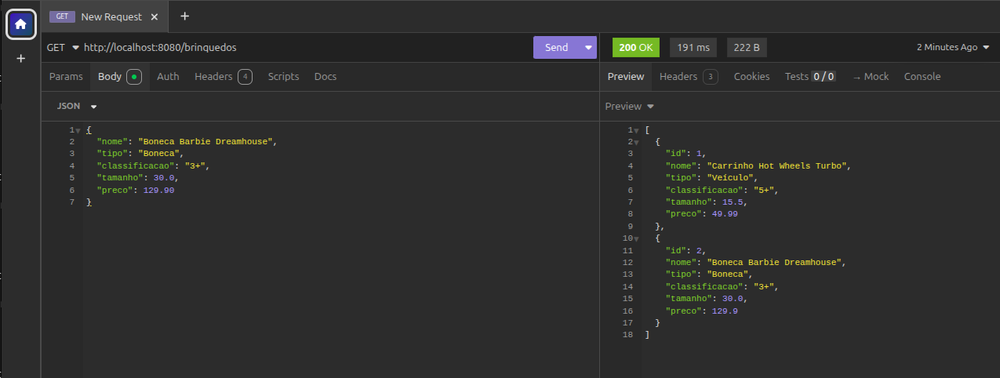
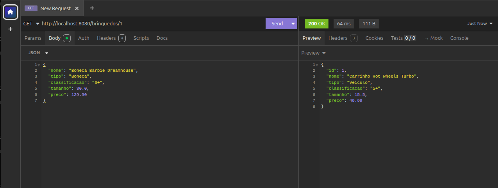
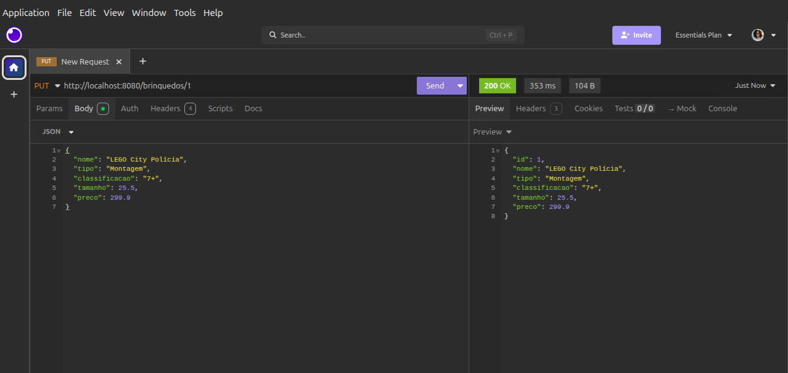
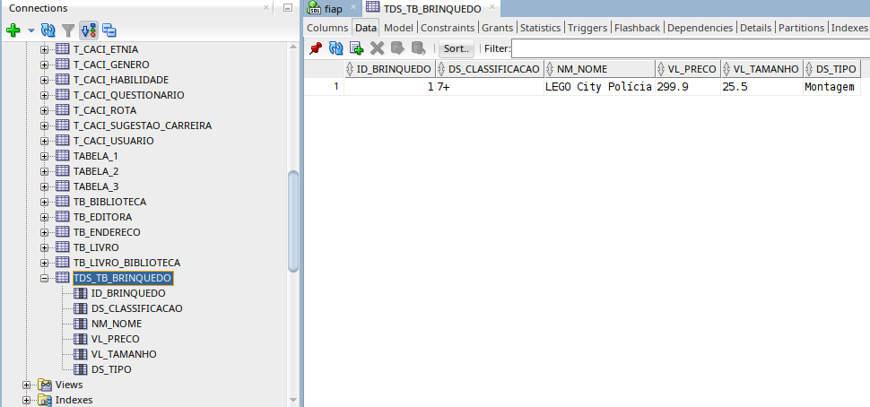
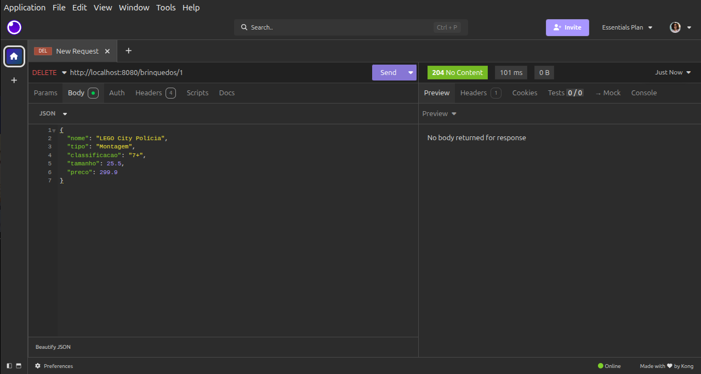
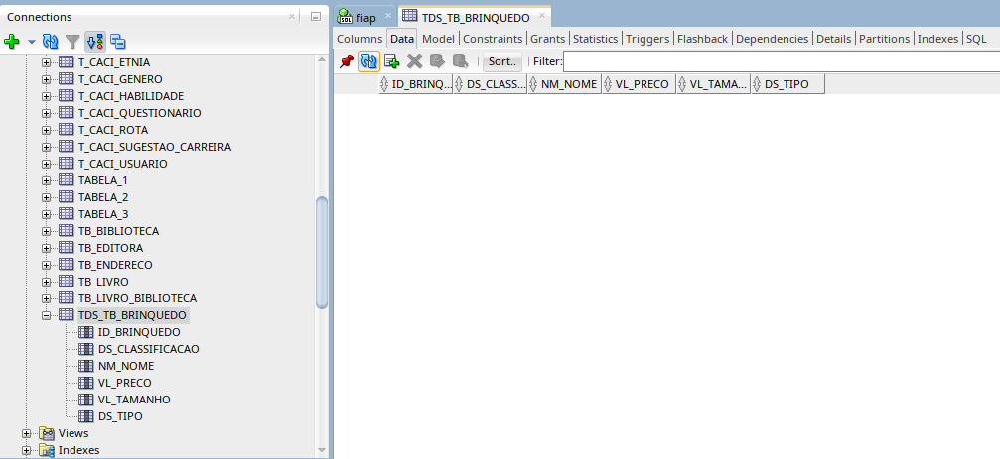

# Checkpoint 2 - Programação Spring Boot com Persistência

## 📋 Descrição do Projeto
Este projeto consiste em uma API REST para gerenciamento de brinquedos utilizando **Spring Boot, JPA/Hibernate e Banco de Dados Oracle**. O objetivo é realizar o ciclo completo de um **CRUD** (Create, Read, Update, Delete) seguindo os princípios RESTful, com persistência em banco de dados Oracle FIAP.

### Regras de Negócio
* **Brinquedo:** Deve conter ID, Nome, Tipo, Classificação (faixa etária), Tamanho e Preço.
* **Classificação:** Destinado a crianças até 14 anos (classificações válidas: 0+, 1+, 2+, 3+, 4+, 5+, 6+, 7+, 8+, 9+, 10+, 11+, 12+, 13+, 14+).
* **Preço:** Deve ser um valor positivo.
* **Validações:** Todos os campos são obrigatórios na criação/atualização.

---

## 📚 **Explicações Técnicas**

**Spring Data JPA vs EntityManager:** O Spring Data JPA reduz código repetitivo ao fornecer interfaces prontas como `JpaRepository`, eliminando a necessidade de escrever consultas manuais, gerenciar transações e tratar exceções com o EntityManager. Para CRUDs simples, é mais produtivo e menos propenso a erros.

**Service Layer:** Centraliza as regras de negócio (validações, cálculos, regras) mantendo o Controller limpo. Permite reuso de lógica e facilita testes.

**Mapper:** Converte Entity (banco) para DTO (API) e vice-versa, evitando código repetido na Service. Se a Entity mudar, só o Mapper precisa ser ajustado.

**DTO:** Define o contrato da API sem expor detalhes internos da Entity. Permite controlar campos de entrada/saída e concentra validações como `@NotBlank` e `@Positive`.

---

## 🛠️ Tecnologias Utilizadas
* **Java 21**
* **Spring Boot 3.x**
* **Spring Data JPA / Hibernate**
* **Oracle Database (Oracle FIAP)**
* **Maven** (gerenciador de dependências)
* **Postman / Insomnia** (testes de API)
* **GitHub** (versionamento)

---

## 📁 Estrutura do Projeto

```
src/main/java/com/fiap/tdspo/toys/
│
├── BrinquedosApplication.java
│
├── controller/
│   └── BrinquedoController.java
│
├── service/
│   ├── BrinquedoService.java
│   └── BrinquedoServiceImpl.java
│
├── repository/
│   └── BrinquedoRepository.java
│
├── model/
│   └── Brinquedo.java
│
└── dto/
    ├── BrinquedoRequestDTO.java
    └── BrinquedoResponseDTO.java
```

---

## 🗄️ Mapeamento Objeto-Relacional (Entity vs. Banco de Dados)

| Atributo na Classe Java | Coluna no Banco (Oracle) | Tipo/Constraint |
| :--- | :--- | :--- |
| `id` | `id_brinquedo` | NUMBER(19) - PRIMARY KEY (Identity) |
| `nome` | `nm_nome` | VARCHAR2(100) - NOT NULL |
| `tipo` | `ds_tipo` | VARCHAR2(50) - NOT NULL |
| `classificacao` | `ds_classificacao` | VARCHAR2(10) - NOT NULL |
| `tamanho` | `vl_tamanho` | NUMBER(10,2) - NOT NULL |
| `preco` | `vl_preco` | NUMBER(10,2) - NOT NULL |

**Configuração do Banco de Dados (application.properties):**
```properties
spring.datasource.url=jdbc:oracle:thin:@oracle.fiap.com.br:1521:ORCL
spring.datasource.username=SEU_USUARIO
spring.datasource.password=SUA_SENHA
spring.datasource.driver-class-name=oracle.jdbc.OracleDriver
spring.jpa.hibernate.ddl-auto=update
spring.jpa.show-sql=true
```

---

## 🔍 Evidências das Etapas (CRUD)

### 1. CREATE (Cadastro de Brinquedo)

**Estrutura do Projeto:**



**Criação da Tabela pelo JPA (Console):**



**Requisição POST - Insomnia:**



**JSON Enviado:**
```json
{
    "nome": "Carrinho Hot Wheels Turbo",
    "tipo": "Veículo",
    "classificacao": "5+",
    "tamanho": 15.5,
    "preco": 49.99
}
```

**Resposta da API:**
```json
{
    "id": 1,
    "nome": "Carrinho Hot Wheels Turbo",
    "tipo": "Veículo",
    "classificacao": "5+",
    "tamanho": 15.5,
    "preco": 49.99
}
```

**Registro Inserido no SQL Developer:**



---

### 2. READ (Consulta de Brinquedos)

**Requisição GET All - Insomnia:**



**Resposta da API:**
```json
[
    {
        "id": 1,
        "nome": "Carrinho Hot Wheels Turbo",
        "tipo": "Veículo",
        "classificacao": "5+",
        "tamanho": 15.5,
        "preco": 49.99
    },
    {
        "id": 2,
        "nome": "Boneca Barbie Dreamhouse",
        "tipo": "Boneca",
        "classificacao": "3+",
        "tamanho": 30.0,
        "preco": 129.90
    }
]
```

**Requisição GET by ID - Insomnia:**



**Resposta da API:**
```json
{
    "id": 1,
    "nome": "Carrinho Hot Wheels Turbo",
    "tipo": "Veículo",
    "classificacao": "5+",
    "tamanho": 15.5,
    "preco": 49.99
}
```

---

### 3. UPDATE (Atualização de Brinquedo)

**Requisição PUT - Insomnia:**



**JSON Enviado:**
```json
{
    "nome": "LEGO City Polícia - Helicóptero",
    "tipo": "Montagem",
    "classificacao": "8+",
    "tamanho": 28.0,
    "preco": 249.99
}
```

**Resposta da API:**
```json
{
    "id": 1,
    "nome": "LEGO City Polícia - Helicóptero",
    "tipo": "Montagem",
    "classificacao": "8+",
    "tamanho": 28.0,
    "preco": 249.99
}
```

**Registro Atualizado no SQL Developer:**



---

### 4. DELETE (Remoção de Brinquedo)

**Requisição DELETE - Insomnia:**



**Registro Removido no SQL Developer:**



---

## 🧪 Exemplos de JSON para Teste

### POST `/brinquedos` - Criar Brinquedo
```json
{
    "nome": "LEGO City Polícia",
    "tipo": "Montagem",
    "classificacao": "7+",
    "tamanho": 25.5,
    "preco": 199.99
}
```

### PUT `/brinquedos/{id}` - Atualizar Brinquedo
```json
{
    "nome": "LEGO City Polícia - Helicóptero",
    "tipo": "Montagem",
    "classificacao": "8+",
    "tamanho": 28.0,
    "preco": 249.99
}
```

### GET `/brinquedos` - Listar Todos

### GET `/brinquedos/{id}` - Buscar por ID

### DELETE `/brinquedos/{id}` - Excluir Brinquedo

---

## 📡 Endpoints da API

| Método | Endpoint | Descrição | Status Code |
| :--- | :--- | :--- | :--- |
| POST | `/brinquedos` | Criar novo brinquedo | 201 Created |
| GET | `/brinquedos` | Listar todos os brinquedos | 200 OK |
| GET | `/brinquedos/{id}` | Buscar brinquedo por ID | 200 OK |
| PUT | `/brinquedos/{id}` | Atualizar brinquedo existente | 200 OK |
| DELETE | `/brinquedos/{id}` | Remover brinquedo | 204 No Content |

---

## 👥 Integrantes
* **Diego Andrade** - RM566385
* **Grazielle de Alencar** - RM561529
* **Julia Corrêa** - RM564870

---

## 📅 Prazo de Entrega
* **Data Final:** 10/05/2026 às 23:59